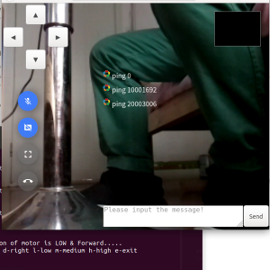

# RTCar

#### Description
Smart-rtc-car using webrtc, opencv on raspberry pi 3+.

#### Features
1. webrtc via internet
2. remote control via data channel
3. processing CV features

#### Software Architecture
Python3 + aiortc + opencv

#### Run
python3 rtcar.py --server=https://your.appr.tc:9090

#### Installation

1. sudo apt install -y python-dev pkg-config
2. sudo apt install -y libavformat-dev libavcodec-dev libavdevice-dev libavutil-dev libswscale-dev libavresample-dev libavfilter-dev libopus-dev libvpx-dev
3. sudo apt install -y ffmpeg
4. sudo apt install -y libffi6 libffi-dev
5. sudo apt install -y build-essential tk-dev libncurses5-dev libncursesw5-dev libreadline6-dev libdb5.3-dev libgdbm-dev libsqlite3-dev libssl-dev libbz2-dev libexpat1-dev liblzma-dev zlib1g-dev libffi-dev
6. sudo apt install -y libsrtp2-dev
7. sudo pip3 install av
8. sudo pip3 install aiohttp aiortc opencv-python websockets
9. sudo pip3 install opencv-contrib-python

#### Instructions

1. Server forking from google-webrtc-apprtc
2. Client forking from aiortc-apprtc example
3. car assembly according by open hardware of raspberry pi
